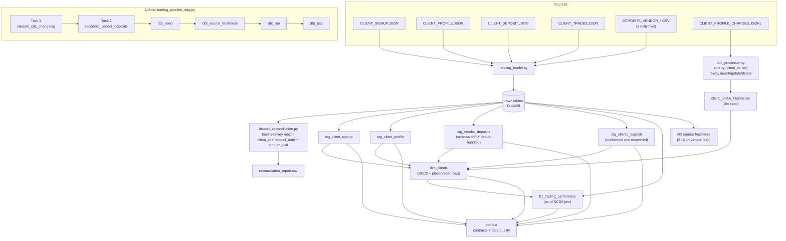

# Deriv Data Engineering Assessment

A pipeline design and working prototype for a trading platform data warehouse: reconciling a third-party vendor deposit feed, replaying a CDC change log into an SCD Type 2 client dimension, and a proposed real-time + batch architecture for fraud detection and reporting.

## How to navigate this repo

| Path | What it is |
|---|---|
| [part1_pipeline.md](part1_pipeline.md) | Pipeline design: architecture, idempotency, late/missing data, delete handling, edge cases |
| [part2_data_model.md](part2_data_model.md) | Dimensional model (star schema), SCD2 historization design |
| [part3_architecture.md](part3_architecture.md) | TL extension: real-time + batch architecture, build vs. buy — **not yet written** |
| [prompts.md](prompts.md) | AI prompts used per part — **not yet written**, needs to become `PROMPTS.md` per the submission spec |
| `data/` | The provided source files (JSON, CSV, JSONL) |
| `code/dags/` | Airflow DAG orchestrating the pipeline |
| `code/dbt/` | dbt project: staging models, marts, tests, seeds |
| `code/scripts/` | Standalone Python: CDC replay, deposit reconciliation, warehouse landing loader |
| `sql/` | Referenced from Part 2 — **not yet written** |

---

## Approach, by part

**Part 1 (pipeline design)** settled on a medallion architecture with two independent source arms — the vendor CSV feed and the CDC log are structurally different (batch snapshot vs. ordered change stream) and are treated that way end to end, not forced through one shape. The core design decisions:
- Idempotency splits into two separate mechanisms: within-feed dedup (vendor's own `deposit_id`) vs. cross-system reconciliation (`client_id` + `deposit_date` + `amount_usd`), because the vendor's `VDEP*` IDs and the warehouse's `DEP*` IDs turned out to be **disjoint namespaces** — confirmed by checking, not assumed.
- Late/missing vendor data self-heals through keyed `MERGE`; a separate SLA check (not the merge logic) is what actually needs monitoring.
- CDC deletes are soft-deleted with a closed-out audit row, never a hard delete.
- All five required edge cases (and two more) are grounded in specific rows in the provided data, not hypothetical — see the table in that document.

**Part 2 (data model)** is a Kimball star schema (`dim_client`, `dim_date`, `dim_instrument`, `fact_deposit`, `fact_trade`) over Data Vault, on the reasoning that this is a small, stable set of entities feeding direct BI consumption, not a many-source integration problem. `dim_client` is SCD Type 2 on `risk_category`, `account_balance_usd`, `account_status`. Late-arriving dimensions are handled via an early-arriving-fact placeholder pattern, motivated directly by real orphan rows in the data (`CL031`, `CL099` — deposits with no matching signup/profile record).

**Part 3 (TL extension)** — not started. `part3_architecture.md` is scaffolded with the brief's required sub-questions but no design decisions yet.

---

## Design files created, and why

| File | Why it exists |
|---|---|
| `code/dbt/models/staging/stg_client_signup.sql` | Typed, cleaned client signup records — one row per client |
| `code/dbt/models/staging/stg_client_profile.sql` | Baseline (pre-CDC) profile snapshot; flags implausible `date_of_birth` values rather than silently accepting them |
| `code/dbt/models/staging/stg_vendor_deposits.sql` | Unions the three daily vendor CSVs, absorbs the `payment_method`→`method` schema drift in the 2024-03-02 file, and dedupes cross-batch re-deliveries by keeping the most recently *delivered* version |
| `code/dbt/models/staging/stg_clients_deposit.sql` | The existing warehouse deposit table; recovers `DEP012`'s value from its malformed `credit_card` column instead of dropping the row |
| `code/dbt/models/marts/dim_clients.sql` | SCD2 client dimension — combines signup (static attrs) + the CDC-replayed profile history (from the seed below) + inferred placeholder rows for orphan clients |
| `code/dbt/models/marts/fct_trading_performace.sql` | One row per trade, joined to the `dim_clients` version active **as of the trade date** (a real SCD2 as-of join, not a plain `client_id` lookup) |
| `code/scripts/cdc_processor.py` | Replays `CLIENT_PROFILE_CHANGES.JSONL` in `(client_id, lsn)` order (not arrival order — see below) to produce the SCD2 version history seed |
| `code/scripts/deposit_reconciliation.py` | Business-key reconciliation of the vendor feed against the warehouse deposit table, since their IDs don't overlap |
| `code/scripts/landing_loader.py` | Loads all `/data` files into `raw.*` DuckDB tables so the dbt project has something to build on |
| `code/dags/trading_pipeline_dag.py` | Airflow DAG: CDC replay → deposit reconciliation → dbt seed/freshness/run/test |
| `code/dbt/dbt_project.yml`, `packages.yml`, `profiles.yml` | dbt project scaffolding (DuckDB target, `dbt_utils` dependency) |
| `code/dbt/models/staging/_sources.yml` | Raw source declarations + freshness (SLA) thresholds on the vendor feed |
| `code/dbt/models/staging/_staging.yml`, `models/marts/_marts.yml` | Contracts + tests (see below) |
| `code/dbt/tests/assert_one_current_version_per_client.sql` | Singular test: exactly one `is_current = true` row per client in `dim_clients` — this caught a real bug (see "What actually broke," below) |

---

## Tests created

Three specific data quality issues were found by inspecting the actual data (not invented), and each is now a real dbt test, not a comment:

| Finding | Where | Test | Severity | Reasoning |
|---|---|---|---|---|
| Unknown `client_id` `CL099` | `DEPOSITS_VENDOR_20240303.CSV`, row `VDEP020` | `relationships` test, `stg_vendor_deposits.client_id` → `stg_client_signup` | **warn** | Expected, self-healing case — `dim_clients` already handles it via the placeholder pattern; shouldn't block the build |
| Unknown `client_id` `CL031` | `CLIENT_DEPOSIT.JSON`, row `DEP020` | Same `relationships` test on `stg_clients_deposit` | **warn** | Same pattern as above |
| Negative deposit amount (`-250.00`) | `DEPOSITS_VENDOR_20240301.CSV`, row `VDEP001` | `dbt_utils.expression_is_true: amount_usd >= 0` | **error** (default) | HIGH severity per Part 1's data quality table — this one is *meant* to fail `dbt test` and page on-call |
| Implausible `date_of_birth` (`1888-12-19`) | `CLIENT_PROFILE.JSON`, client `CL025` | `accepted_values` on an `is_dob_suspect` flag computed in staging | **warn** | Needs a source-side correction, not a pipeline guess — flagged for investigation, not auto-fixed |

Plus the standard integrity layer: `unique`/`not_null` on every natural and surrogate key across staging and marts, `accepted_values` on `kyc_status` and `risk_category`, and **data contracts enforced** on all four staging models (column names/types must match exactly — this is what would catch a *future* schema drift the moment it lands, the same class of issue as the `method`/`payment_method` rename).

### What actually broke, and got fixed, while validating this end to end

Running `dbt test` for real (not just reading the SQL) surfaced a genuine bug: `assert_one_current_version_per_client` failed — `CL030` had **two** simultaneous `is_current = true` rows in `dim_clients`. Cause: `CL030` exists in the baseline `CLIENT_PROFILE.JSON` snapshot *and* has an `insert` event in the CDC log (`lsn 1001`). The original `cdc_processor.py` treated every `insert` op as a fresh genesis version without checking whether the client already had an open version, so the baseline row and the CDC-inserted row both stayed "current." Fixed by making `insert` behave like `update` when a version is already open for that client (close the old one; skip entirely if the attributes are identical). Re-ran the full pipeline — the test now passes, and every other test result matches the four findings above exactly (1 error, 3 warnings, nothing else).

---

## Architecture / end-to-end flow



**Flow, in words:**
1. `landing_loader.py` loads all six raw `/data` files into DuckDB `raw.*` tables (uses `union_by_name` so `CLIENT_DEPOSIT.JSON`'s malformed `DEP012` row doesn't crash the load).
2. `cdc_processor.py` reads the CDC log directly from disk (it never goes through `raw.*` — this is a deliberate call: CDC replay is a sequential state-machine, a poor fit for set-based SQL, so it's done once in Python and the *result* — a fully-versioned SCD2 table — is what dbt consumes as a seed).
3. `deposit_reconciliation.py` matches vendor deposits against the warehouse table on business key and writes a standalone reconciliation report.
4. dbt builds staging (contract-enforced, schema drift and malformed rows absorbed) → marts (`dim_clients` SCD2, `fct_trading_performace` with an as-of join) → runs tests (data quality + integrity) and source freshness (SLA).
5. Airflow (`trading_pipeline_dag.py`) orchestrates steps 2–4 in sequence, with per-task SLAs on the two Python steps.

---

## Running it end-to-end

This was actually executed against the real data in this repo (not just written and assumed to work) — the exact commands:

```bash
# 1. isolated environment
python -m venv .venv
./.venv/Scripts/pip install dbt-duckdb

# 2. land the raw files into DuckDB
./.venv/Scripts/python code/scripts/landing_loader.py --data-dir data --db code/dbt/deriv_assessment.duckdb

# 3. replay the CDC log
./.venv/Scripts/python code/scripts/cdc_processor.py

# 4. reconcile the vendor deposit feed (standalone, writes its own report)
./.venv/Scripts/python code/scripts/deposit_reconciliation.py

# 5. dbt: install deps, load the CDC seed, build, test, check freshness
cd code/dbt
../../.venv/Scripts/dbt deps --profiles-dir .
../../.venv/Scripts/dbt seed --profiles-dir .
../../.venv/Scripts/dbt run  --profiles-dir .
../../.venv/Scripts/dbt test --profiles-dir .
../../.venv/Scripts/dbt source freshness --profiles-dir .
```

**Last validated run**: 6/6 models built (all contracts held), 25 dbt tests → 21 pass, 3 warn (intended), 1 error (intended — the negative deposit amount), 3/3 sources fresh.

---

## Known gaps (not yet done)

- `sql/` is empty — Part 2a references `sql/schema.sql`, which hasn't been written yet.
- `part3_architecture.md` is a scaffold only — the real-time/batch architecture and build-vs-buy sections haven't been designed.
- `prompts.md` is empty and needs both content and a rename to `PROMPTS.md` per the submission spec.
- The reconciliation script's `matched`/`mismatch` branch (comparing `fee_usd`, `payment_method`, etc. when a business-key match *does* exist) is implemented but untested by this dataset — none of the sample vendor rows happen to overlap with an existing warehouse deposit, so that code path has never actually run against real matching data.
